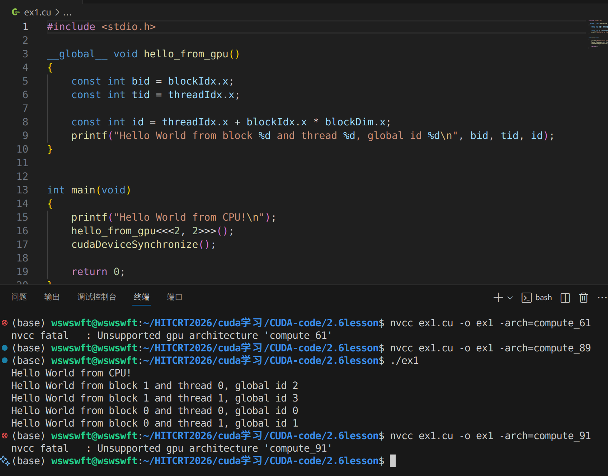

# CUDA - 编译与兼容性

## nvcc编译流程与GPU计算能力

### nvcc编译流程

- nvcc分离全部源代码为：（1）主机代码 （2）设备代码

- 主机（Host）代码完整支持C/C\+\+语法，设备（device）代码是C/C\+\+扩展语言编写

- nvcc先将设备代码编译为PTX（Parallel Thread Execution）伪汇编代码，再将PTX代码编译为二进制的cubin目标代码

- 在将源代码编译为 PTX 代码时，需要用选项\-arch=compute\_XY指定一个虚拟架构的计算能力，用以确定代码中能够使用的CUDA功能

- 在将PTX代码编译为cubin代码时，需要用选项\-code=sm\_ZW指定一个真实架构的计算能力，用以确定可执行文件能够使用的GPU

- \-arch=compute\_XY与\-code=sm\_ZW都与GPU兼容性有关

- 真实结构计算能力一定要大于虚拟架构计算能力

- 具体cuda编译链接流程参考：https://docs\.nvidia\.com/cuda/cuda\-compiler\-driver\-nvcc/index\.html 包含编译流程，编译指令

- PTX介绍：

    - PTX（Parallel Thread Execution）是CUDA平台为基于GPU的通用计算而定义的虚拟机和指令集

    - nvcc编译命令总是使用两个体系结构:一个是虚拟的中间体系结构，另一个是实际的GPU体系结构

    - 虚拟架构更像是对应用所需的GPU功能的声明

    - 虚拟架构应该尽可能选择低\-\-\-\-适配更多实际GPU

    真实架构应该尽可能选择高\-\-\-\-充分发挥GPU性能

    - PTX 文 档 ： https://docs\.nvidia\.com/cuda/parallel\-thread\-execution/index\.html

### GPU架构与计算能力

1. 每款GPU都有用于标识“计算能力”（ compute capability ）

的版本号

2. 形式X\.Y，X表示主版本号，Y表示次版本号

    1. 通常情况下主版本号代表一个CPU的架构，每一个架构的指令集与指令编码不同

    2. 同一主版本号下，次版本号高的可以兼容低的

3. 并非GPU 的计算能力越高，性能就越高

## CUDA程序兼容性问题

### 指定虚拟架构计算能力   

- C/C\+\+源码编译为PTX时，可以指定虚拟架构的计算能力，用来确定代码中能够使用的CUDA功能（对所需GPU功能的一种声明）

- C/C\+\+源码转化为PTX这一步骤与GPU硬件无关

- 编译指令（指定虚拟架构计算能力）：

    - \-arch=compute\_**XY**

    - **XY**：第一个数字**X**代表计算能力的主版本号，第二个数字**Y**代表计算能力的次版本号（限制程序能运行的最低版本）

- PTX的指令只能在更高的计算能力的GPU使用

    - 例如:

        - nvcc helloworld\.cu –o helloworld \-arch=compute\_61

        - 编译出的可执行文件helloworld可以在计算能力\>=6\.1的GPU上面执行，在计算能力小于6\.1的GPU则不能执行。

        - GPU计算能力查询：https://developer\.nvidia\.com/cuda\-gpus

        - RTX 4060为8\.9,最低支持7\.5

### 指定真实架构计算能力

- PTX指令转化为二进制cubin代码与具体的GPU架构有关

- 编译指令（指定真实架构计算能力）：

    - \-code=sm\_**XY**

    - **XY**：第一个数字**X**代表计算能力的主版本号，第二个数字**Y**代表计算能力的次版本号

- 注意：

    - （1）二进制cubin代码，大版本之间不兼容！！！

        - 对于4060 \-code=sm\_7**Y**与code=sm\_9**Y都跑不通**

    - （2）指定真实架构计算能力的时候必须指定虚拟架构计算能力！！！

    - （3）指定的真实架构能力必须大于或等于虚拟架构能力！！！

        - ~~nvcc helloworld\.cu –o helloworld \-arch=compute\_61 \-code=sm\_60~~

- 真实架构可以实现低小版本到高小版本的兼容！

### 指定多个GPU版本编译

- 使得编译出来的可执行文件可以在多GPU中执行

- 同时指定多组计算能力：

    - 编译选项 \-gencode arch=compute\_XY –code=sm\_XY

    - 例如：

        - \-gencode=arch=compute\_35,code=sm\_35开普勒架构

        - \-gencode=arch=compute\_50,code=sm\_50麦克斯韦架构

        - \-gencode=arch=compute\_60,code=sm\_60帕斯卡架构

        - \-gencode=arch=compute\_70,code=sm\_70伏特架构

- 编译出的可执行文件包含4个二进制版本，生成的可执行文件称为胖二进制文件（fatbinary）

- 注意：

    - （1）执行上述指令必须CUDA版本支持7\.0计算能力，否则会报错

    - （2）过多指定计算能力，会增加编译时间和可执行文件的大小

### nvcc即时编译

- 让你在低计算能力中也能生成高计算能力GPU可执行文件

- 在运行可执行文件时，从保留的PTX代码临时编译出cubin文件

- 在可执行文件中保留PTX代码，nvcc编译指令指定所保留的PTX代码虚拟架构：

    - 指令： \-gencode arch=compute\_XY ,code=compute\_XY

    - 注意：

        - （1）两个计算能力都是虚拟架构计算能力

        - （2）两个虚拟架构计算能力必须一致

- 例如： 

    - \-gencode=arch=compute\_35,code=sm\_35

    - \-gencode=arch=compute\_50,code=sm\_50

    - \-gencode=arch=compute\_61,code=sm\_61

    - \-gencode=arch=compute\_61,code=compute\_61 //加这一句

- 简化： \-arch=sm\_XY

    - 等价于 \-gencode=arch=compute\_61,code=sm\_61

    - \-gencode=arch=compute\_61,code=compute\_61

### nvcc编译默认计算能力

- 本机默认计算能力7\.5
