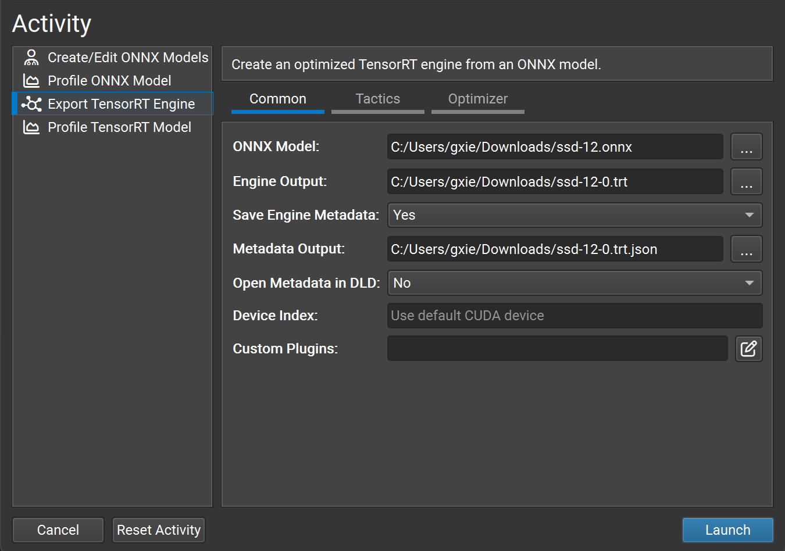

# TensorRT - ONNX 转换与部署

## 使用 ONNX 的部署示例

- [ONNX](https://github.com/onnx/onnx/blob/main/docs/IR.md) 是一种与框架无关的模型格式，可以从大多数主要框架导出，包括 TensorFlow 和 PyTorch。TensorRT 提供了一个库，用于通过 [ONNX\-TRT 解析器](https://github.com/onnx/onnx-tensorrt)将 ONNX 直接转换为 TensorRT 引擎。

- 本节将介绍将 ONNX model zoo中的预训练 ResNet\-50 模型转换为 TensorRT 引擎的五个步骤。从视觉上看，这是我们将遵循的过程：


- 了解  TensorRT 工作流程的基本步骤后，您可以深入了解 Jupyter 笔记本（请参阅以下主题），了解如何使用 Torch\-TensorRT 或  ONNX 使用 TensorRT。使用 PyTorch 框架，您可以按照介绍性的 Jupyter Notebook [ 运行本指南](https://github.com/NVIDIA/TensorRT/tree/main/quickstart/IntroNotebooks/0.%20Running%20This%20Guide.ipynb)进行作，其中更详细地介绍了这些工作流程步骤。

## 导出模型

- TensorRT 转换的主要自动路径需要不同的模型格式才能成功转换模型：ONNX 路径要求将模型保存在 ONNX 中。

- 我们在此示例中使用了 ONNX，因此我们需要一个 ONNX 模型。我们将使用 ResNet\-50，这是一种可用于各种目的的基本骨干视觉模型。我们将使用 [ONNX model zoo](https://github.com/onnx/models)中包含的预训练 ResNet\-50 ONNX 模型进行分类。

- 使用 wget 从 ONNX 模型动物园下载预训练的 ResNet\-50 模型并解压缩它。

```C++
wget https://download.onnxruntime.ai/onnx/models/resnet50.tar.gztar xzf resnet50.tar.gz
```

- 这会将预训练的 ResNet\-50 `.onnx` 文件解压缩到路径 `resnet50/model.onnx`。

- 在[从 PyTorch 导出到 ONNX 中 ](https://docs.nvidia.com/deeplearning/tensorrt/latest/getting-started/quick-start-guide.html#export-from-pytorch)，您可以看到我们如何导出适用于同一部署工作流程的 ONNX 模型。

## 选择精度

- 推理通常比训练需要更少的数字精度。小心一点，较低的精度可以为您提供更快的计算速度和更低的内存消耗，而不会牺牲任何有意义的准确性。TensorRT 支持 FP32、FP16、FP8、BF16 和 INT8 精度，以及对 INT4 权重的有限支持。

- FP32 是大多数框架的默认训练精度，因此我们将从这里使用它进行推理开始。

```C++
import numpy as np
PRECISION = np.float32
```

- 我们设置 TensorRT 引擎在运行时应使用的精度，我们将在下一节中执行此作。

## 转换模型

- ONNX 转换路径是自动 TensorRT 转换最通用、性能最强的路径之一。它适用于 TensorFlow、PyTorch 和许多其他框架。

- 有几种工具可帮助您将模型从 ONNX 转换为 TensorRT 引擎。一种常见的方法是使用 `trtexec`——TensorRT 附带的命令行工具，除其他外，可以将 ONNX 模型转换为 TensorRT 引擎并对其进行分析。

- 我们可以按如下方式运行此转换：

```C++
trtexec --onnx=resnet50/model.onnx --saveEngine=resnet_engine_intro.engine –-stronglyType
```

- 这会使用 [strong typing](https://docs.nvidia.com/deeplearning/tensorrt/latest/architecture/capabilities.html#strong-vs-weak-typing)将我们的 `resnet50/model.onnx` 转换为名为 `resnet_engine_intro.engine` 的 TensorRT 引擎。

> - 要告诉 `trtexec` 在哪里可以找到我们的 ONNX 模型，请使用以下选项：
> 
> ```C++
> --onnx=resnet50/model.onnx
> ```
> 
> - 要告诉 `trtexec` 将优化的 TensorRT 引擎保存在何处，请使用以下选项：
> 
> ```C++
> --saveEngine=resnet_engine_intro.engine
> ```
> 
> 

- 对于喜欢基于 GUI 的工具的易用性的开发人员，[Nsight 深度学习设计器](https://developer.nvidia.com/nsight-dl-designer)使您能够轻松地将 ONNX 模型转换为 TensorRT 引擎文件。`trtexec` 的大多数命令行参数也可以在 Nsight Deep Learning Designer 的 GUI 上找到。



## 部署模型

- 成功创建 TensorRT 引擎后，我们必须决定如何使用 TensorRT 运行它。

- TensorRT 运行时有两种类型：具有 C\+\+ 和 Python 绑定的独立运行时和与 PyTorch 的本机集成。本部分将使用调用独立运行时的简化包装器 （`ONNXClassifierWrapper`） 。我们将生成一批随机的“虚拟”数据，并使用我们的 `ONNXClassifierWrapper` 对该批次运行推理。有关 TensorRT 运行时的更多信息，请参阅[了解 TensorRT 运行时 ](https://github.com/NVIDIA/TensorRT/tree/main/quickstart/IntroNotebooks/5.%20Understanding%20TensorRT%20Runtimes.ipynb) Jupyter Notebook。

1. 设置 `ONNXClassifierWrapper`（使用我们在[选择精度中](https://docs.nvidia.com/deeplearning/tensorrt/latest/getting-started/quick-start-guide.html#select-precision)确定的精度）。

```C++
from onnx_helper import ONNXClassifierWrapper
trt_model = ONNXClassifierWrapper("resnet_engine.trt", target_dtype = PRECISION)
```

2. 生成虚拟批次

```C++
input_shape = (1, 3, 224, 224)
dummy_input_batch = np.zeros(input_shape , dtype = PRECISION)
```

3. 将一批数据输入我们的引擎并获取我们的预测

```C++
predictions = trt_model.predict(dummy_input_batch)
```

- 请注意，包装器在运行第一批时加载并初始化引擎，因此此批处理通常需要一段时间。有关批处理的详细信息，请参阅[批处理](https://docs.nvidia.com/deeplearning/tensorrt/latest/performance/best-practices.html#batching)部分。

- 有关 TensorRT API 的更多信息，请参阅 [NVIDIA TensorRT API 文档 ](https://docs.nvidia.com/deeplearning/tensorrt/latest/index.html)。有关 `ONNXClassifierWrapper` 的详细信息，请参阅 [GitHub 上的实现：onnx\_helper\.py](https://github.com/NVIDIA/TensorRT/blob/HEAD/quickstart/IntroNotebooks/onnx_helper.py)

## ONNX 转换和部署

- ONNX  交换格式提供了一种从许多框架（包括 PyTorch、TensorFlow 和 TensorFlow 2）导出模型以与 TensorRT  运行时一起使用的方法。使用 ONNX 导入模型需要模型中的运算符受 ONNX 支持，并且您需要提供 TensorRT  不支持的任何运算符的插件实现。（TensorRT 的插件库可以在 [GitHub 上找到：plugin](https://github.com/NVIDIA/TensorRT/tree/main/plugin)）。

- 使用 ONNX 导出:

    - 使用 PyTorch [ 导出](https://pytorch.org/tutorials/beginner/onnx/export_simple_model_to_onnx_tutorial.html)可以从 PyTorch 模型轻松生成 ONNX 模型。

    - [通过 ONNX 笔记本将 PyTorch 与 TensorRT 结合使用](https://github.com/NVIDIA/TensorRT/blob/HEAD/quickstart/IntroNotebooks/2.%20Using%20PyTorch%20through%20ONNX.ipynb)展示了如何从 PyTorch ResNet\-50 模型生成 ONNX 模型，使用 `trtexec` 将这些ONNX 模型转换为 TensorRT 引擎，以及使用 TensorRT 运行时在推理时将输入输入输入到 TensorRT 引擎。

- 从 PyTorch 导出到 ONNX:

    - 将 PyTorch 模型转换为 TensorRT 的一种方法是将 PyTorch 模型导出到 ONNX，然后将其转换为 TensorRT 引擎。有关更多详细信息，请参阅[通过 ONNX 将 PyTorch 与 TensorRT 一起使用 ](https://github.com/NVIDIA/TensorRT/blob/HEAD/quickstart/IntroNotebooks/2.%20Using%20PyTorch%20through%20ONNX.ipynb)。笔记本将引导你完成此路径，从以下导出步骤开始：


        1. 从 `torchvision` 导入 ResNet\-50 模型。这将加载具有预训练权重的 ResNet\-50 副本

        ```C++
        import torchvision.models as modelsresnet50 = models.resnet50(pretrained=True, progress=False).eval())
        ```

        2. 从 PyTorch 保存 ONNX 文件，我们需要一批数据来保存 PyTorch 中的 ONNX 文件。我们将使用虚拟批次。

        ```C++
        import torch
        
        BATCH_SIZE = 32
        dummy_input=torch.randn(BATCH_SIZE, 3, 224, 224)
        ```

        3. 保存 ONNX 文件

        ```C++
        import torch.onnx
        torch.onnx.export(resnet50, dummy_input, "resnet50_pytorch.onnx", verbose=False)
        )
        ```

### 将 ONNX 转换为 TensorRT 引擎

- 将 ONNX 文件转换为 TensorRT 引擎主要有三种方法：

    1. 使用 `trtexec`

    2. 使用 TensorRT API

    3. 使用 [Nsight 深度学习设计器 ](https://developer.nvidia.com/nsight-dl-designer) GUI

- 在本节中，我们将重点介绍如何使用 `trtexec`。要使用 `trtexec` 将上述 ONNX 模型之一转换为 TensorRT 引擎，我们可以按如下方式运行此转换：

```C++
trtexec --onnx=resnet50_pytorch.onnx --saveEngine=resnet_engine_pytorch.trt
```
